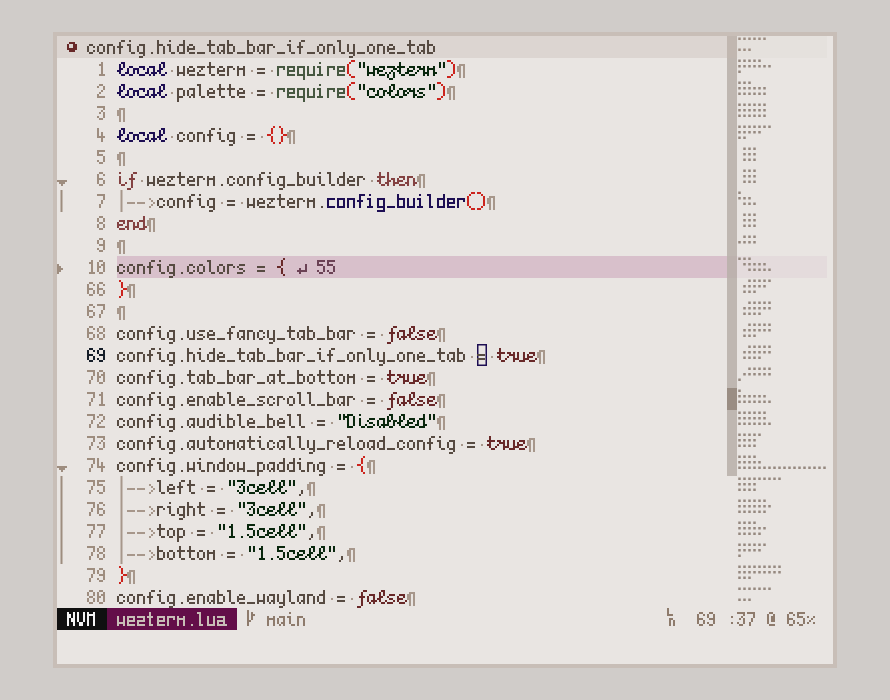

# dmg

__A neovim colorscheme based on DMG-01__



## Installation

Using lazy.nvim:

```
{
	"git.bim.boats/dmg",
	lazy = false,
	priority = 1000,
	config = function()
		vim.api.nvim_command("colorscheme dmg")
	end,
},
```
