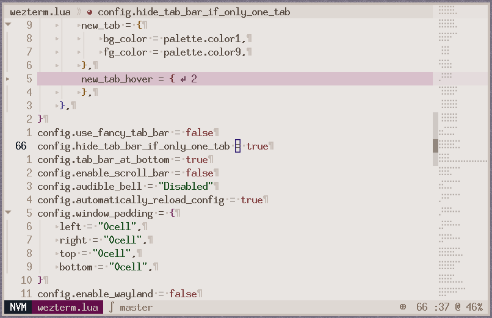

# dmg

**A neovim colorscheme based on DMG-01**



## Installation

Using lazy.nvim:

```lua
{
	"mstcl/dmg",
	lazy = false,
	priority = 1000,
	config = function()
		vim.api.nvim_command("colorscheme dmg")
	end,
},
```

## Enabling plugins integration

To build the colorscheme, we need [Lush](https://github.com/rktjmp/lush.nvim) and [Shipwright](https://github.com/rktjmp/shipwright.nvim).

Head to [src/dmg.lua](./src/dmg.lua). Plugins are defined after default
highlights (so near the bottom). Uncomment them, run `:Lushify` and then
`Shipwright`. A `colors/dmg.vim` is generated. Use this as the new colorscheme.
